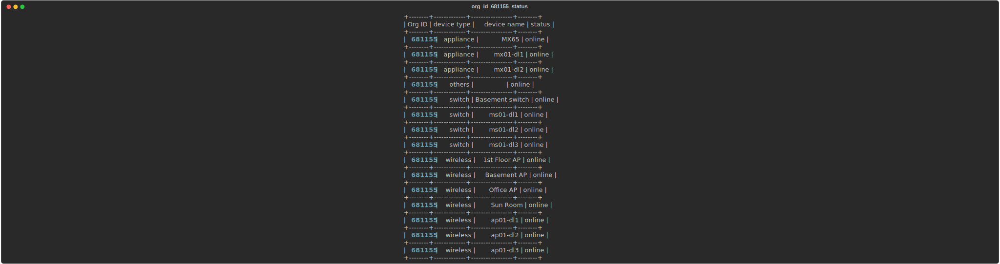

# Meraki-To-MindMaps

[](https://developer.cisco.com/codeexchange/github/repo/AngelIV23/Meraki-To-MindMaps)


# Instalacion para Sistemas operativos basadso en Debian
Entorno virtual de Python

Recomendamos ejecutar Mind nMap en un entorno virtual de Python durante las pruebas o el desarrollo. Esto ayudará a mantener limpio su sistema host y le permitirá tener múltiples entornos para probar cosas nuevas. Si no está utilizando un entorno virtual, comience en el paso de descarga/clonación a continuación.
También necesitará Python 3, pip y venv instalados en su sistema host.

Paso 1. En el directorio de su proyecto, cree su entorno virtual
```bash
python3 -m venv myvenv
```
Paso 2. Activa (usa) tu nuevo entorno virtual (Linux):
```bash
source myvenv/bin/activate
```
Paso 3. Descarga o clona el repositorio mind_nmap:
```bash
git clone https://github.com/AngelIV23/Meraki-To-MindMaps.git
```

Paso 4. Si es necesario, puede crear opcionalmente las siguientes carpetas según los requisitos actuales y los ajustes de código que le gustaría realizar:
```bash
mkdir outputs logs
```
Paso 5. Instale markmap en su entorno:
```bash
sudo apt update
sudo apt install npm
sudo npm install markmap-cli -g
```
Paso 6a. Cree un archivo .env que contendrá la CLAVE API de la(s) organización(es) con el siguiente formato:
```
API_KEY = <API key or token from Dashboard>
```

Paso 6b. O bien, puede obtener fácilmente la clave de API pública y jugar con API calls utilizando la sección Práctica de Cisco Meraki:

https://developer.cisco.com/meraki/meraki-platform/

## Correr en tu entorno la aplicacion:

1. Ejecute el script principal que recopilará automáticamente los datos de la clave correspondiente (de forma predeterminada, se utiliza la API de Meraki):
```
python meraki_api_main.py
```

2. Aparecerán varios mensajes de registro en la consola notificando el paso actual, incluida la barra de progreso:


3. Se generará un bucle entre las organizaciones necesarias para generar archivos SVG, incluido el estado actual de cada dispositivo:


4. Output 1. Archivo de MarkMap para licencias globales:


5. Output 2. Archivo SVG por cada OrgID:



## Desarrollos futuros:
 - Gather SVG and markmap by choosing an OrgID. filename should include OrgID.
 - Gather and sort Offline / online devices within an OrgID.
