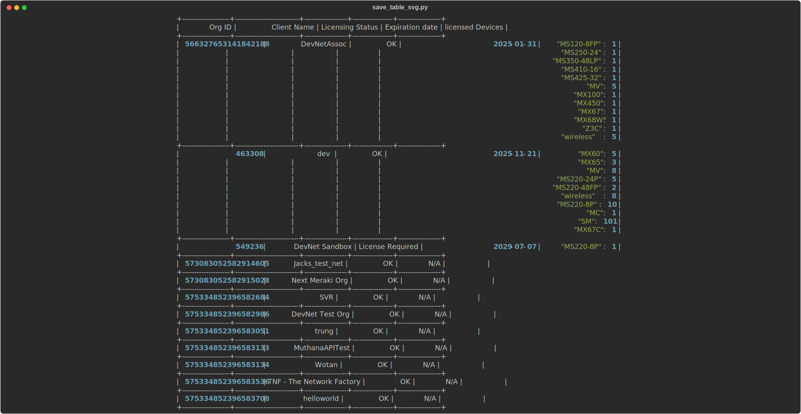
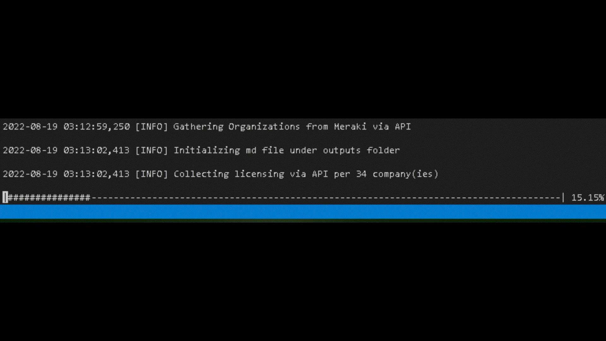
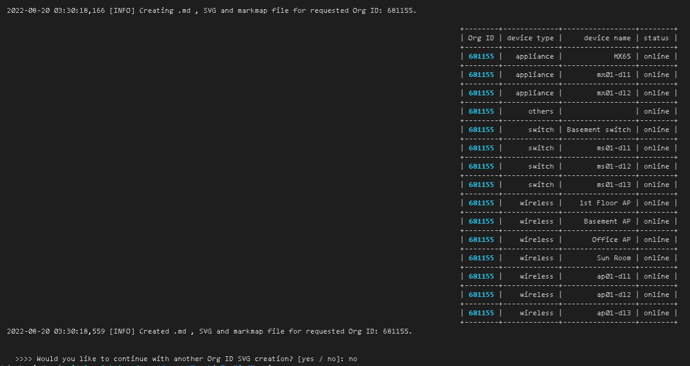

# Meraki-To-MindMaps



# Installation for debian-based OS
Virtual Environment

We recommend running Mind nMap in a Python virtual environment while testing or developing. This will help keep your host system clean and allow you to have multiple environments to try new things. If you are not using a virtual environment, start at the download/clone step below.

You will also need Python 3, pip, and venv installed on your host system.

In your project directory, create your virtual environment
``` console
python3 -m venv myvenv
```
Activate (use) your new virtual environment (Linux):
``` console
source myvenv/bin/activate
```
Download or clone the mind_nmap repository:

``` console
git clone https://github.com/AngelIV23/Meraki-To-MindMaps.git
```

If needed, you can create optionally the next folders depending on current requirements and code tweaks you'd like to make:
```
mkdir outputs logs

Install markmap into your environment:
``` console
sudo apt update
sudo apt install npm
sudo npm install markmap-cli -g
```

Create .env file which will contain the API KEY from the organization(s) with the next format:
```
API_KEY = <API key or token from Dashboard>
```

## Application walkthorugh:

1. Run the main script which will automatically gather data from corresponding key (by default, Meraki API is being used):
```
python meraki_api_main.py
```

2. Multiple log messages will appear in the console notifying the current step including progress bar:



3. Looping in as many organizations required to generate SVG files including each device current status:



## Future developments
 - Gather SVG and markmap by choosing an OrgID. filename should include OrgID.
 - Gather and sort Offline / online devices within an OrgID.
